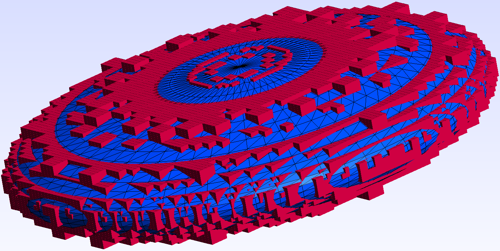
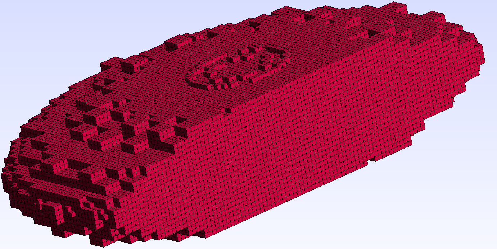
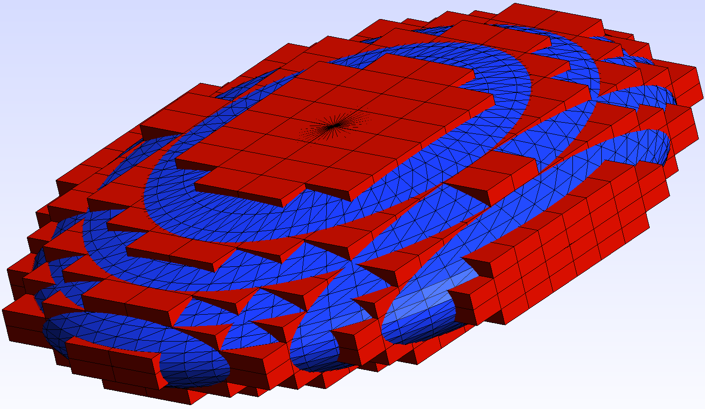
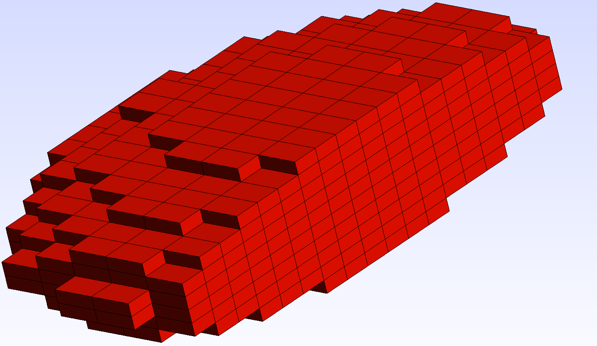

# Approximate Boxes

Approximate Boxes is a small C++ project that intends to approximate a volume with cubes using octrees. 
It leverages the power of the Computational Geometry Algorithms Library (CGAL) to perform this task.

## Features

- Approximation of a volume provided by an OFF file with cubes using octrees
- Saving the boxes as hexahedral elements in the Gmsh file format

## Prerequisites

- C++ compiler with C++17 support
- CMake (version 3.10 or higher)
- CGAL library (Download and install from [here](https://www.cgal.org/download.html))

## Building the Project

1. Clone the repository:
    ```bash
    git clone https://github.com/paulotto/approximate_boxes.git
    ```

2. Navigate to the project directory:
    ```bash
    cd approximate_boxes
    ```
3. Create a build directory and navigate to it:
    ```bash
    mkdir build && cd build
    ```

4. Run CMake and build the project:
    ```bash
    cmake ..
    make
    ```
## Usage

After building the project, you can run the example program that uses an octree with the following command:
```bash
./bin/ApproximateBoxesExampleOctree "../resources/ellipsoid.off"
```
This command will generate a Gmsh file with the boxes approximating the volume of the ellipsoid, 
placed in the [resources](./resources) folder. 

>**Note**: The degree of approximation is primarily determined by the number of nodes used for the surface in the 
>OFF file. The more nodes, the more accurate the approximation will be and the smaller the boxes.
>Furthermore, the approximation can be influenced by the 
>``` ApproximateBoxes<>::SetOctreeMaxDepth(unsigned int depth) ``` and 
>``` ApproximateBoxes<>::SetOctreeMaxInliers(unsigned int inliers) ``` functions.

To have a completely connected mesh, it is necessary to divide the larger boxes into smaller ones so that every box
has the same dimensions. This can be done by setting the 
``` ApproximateBoxes<>::SetDivideBoxes(bool divide) ``` function to true (default: true). Below you can see an example
where the ellipsoid is approximated with and without dividing the boxes.

>**Note**: If the boxes are divided, the number of boxes will increase significantly, 
>leading to longer computation times.

### Ellipsoid Approximation Without Dividing the Boxes
|  |  |  |
|:---------------------------------:|:----------------------------------------:|:-----------------------------------:|  
|             Ellipsoid             |        Ellipsoid + Approximation         |          Approximation Cut          |

### Ellipsoid Approximation With Dividing the Boxes
|  |  |  |
|:---------------------------------:|:--------------------------------------------:|:---------------------------------------:|  
|             Ellipsoid             |          Ellipsoid + Approximation           |            Approximation Cut            |

### Simple Approximation Implementation
There is also a simpler implementation of the approximation without using an octree. Here, the bounding box of the
geometry is divided into smaller boxes, which are then checked for intersection with the geometry.

To run the example for this implementation, use the following command:
```bash
./bin/ApproximateBoxesExampleSimple "../resources/ellipsoid.off"
```

>**Note**: The dimensions of the approximating boxes are determined by the dividing factor that is used to divide
> the bounding box of the geometry. The smaller the dividing factor, the smaller the boxes and the more accurate the 
> approximation. The dividing factor can be set for each dimension individually as parameter of the function 
> ``` ApproximateBoxes<>::ApproximateGeometrySimple(CGAL::Vector_3<>) ```

|  |  |  |
|:---------------------------------:|:-----------------------------------------------:|:------------------------------------------:|  
|             Ellipsoid             |            Ellipsoid + Approximation            |             Approximation Cut              |

## License
This project is licensed under the LGPL-3.0 License. See the [LICENSE](LICENSE) file for more details.
