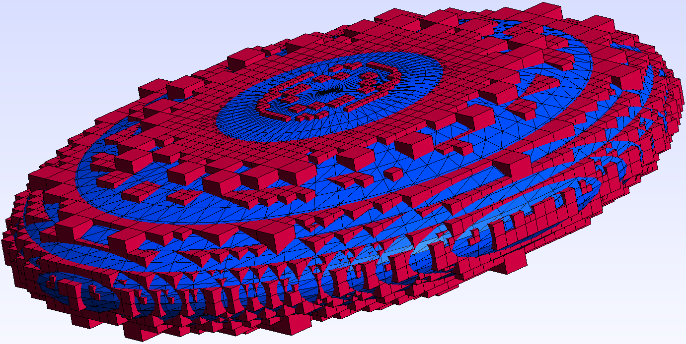
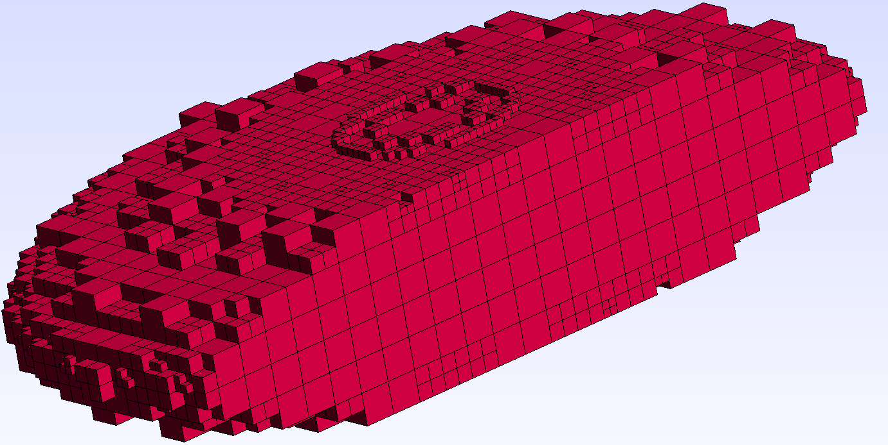

# Approximate Boxes

Approximate Boxes is a small C++ project that intends to approximate a volume with cubes using octrees. 
It leverages the power of the Computational Geometry Algorithms Library (CGAL) to perform this task.

## Features

- Approximation of a volume provided by an OFF file with cubes using octrees
- Saving the boxes as hexahedral elements in the Gmsh file format

## Prerequisites

- C++ compiler with C++17 support
- CMake (version 3.10 or higher)
- CGAL library (Download and install from [here](https://www.cgal.org/download.html))

## Building the Project

1. Clone the repository:
    ```bash
    git clone https://github.com/paulotto/approximate_boxes.git
    ```

2. Navigate to the project directory:
    ```bash
    cd approximate_boxes
    ```
3. Create a build directory and navigate to it:
    ```bash
    mkdir build && cd build
    ```

4. Run CMake and build the project:
    ```bash
    cmake ..
    make
    ```
## Usage

After building the project, you can run the example program with the following command:
```bash
./bin/ApproximateBoxesExample "../resources/ellipsoid.off"
```
This command will generate a Gmsh file with the boxes approximating the volume of the ellipsoid, 
placed in the [resources](./resources) folder. 

>**Note**: The degree of approximation is primarily determined by the number of nodes used for the surface in the OFF file.
The more nodes, the more accurate the approximation will be and the smaller the boxes.
Furthermore, the approximation can be influenced by the max depth of the octree, which can be set 
with the ``` ApproximateBoxes<>::SetOctreeMaxDepth(unsigned int depth) ``` function.

|  |  |  |
|:---------------------------------:|:----------------------------------------:|:-----------------------------------:|  
|             Ellipsoid             |        Ellipsoid + Approximation         |          Approximation Cut          |

## License
This project is licensed under the LGPL-3.0 License. See the [LICENSE](LICENSE) file for more details.
